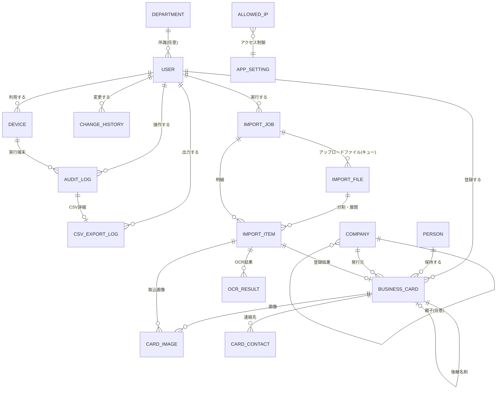
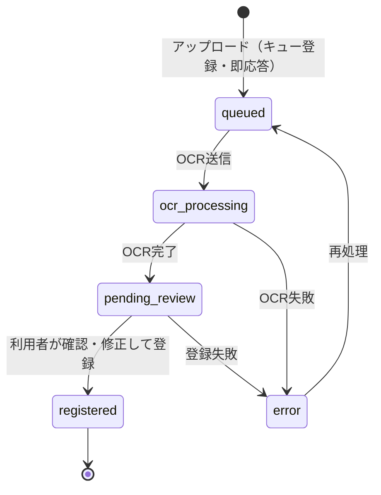

# 名刺一元管理システム データモデル（ER設計）

**Ver.0.3 ドラフト**

対象範囲：人物 / 会社 / 名刺 / 変更履歴 / 監査ログ を中心とした論理データモデル。
要件定義書 [`requirements-v0.2.md`](./requirements-v0.2.md) の確定事項を前提とする。

---

## 1. 設計方針

| # | 方針 | 根拠（要件） |
| --- | --- | --- |
| 1 | **人物（person）と名刺（business_card）を分離**し、1人物に複数名刺をぶら下げる | §10 同一人物の複数名刺管理 |
| 2 | 会社（company）も独立エンティティとし、名刺から参照する | §10 複数会社所属 |
| 3 | 名刺は**世代管理**（`is_latest` + `superseded_by_card_id`）し、旧名刺を履歴として残す | §10 標準動作 |
| 4 | 削除は原則**論理削除**（`deleted_at` 等）。完全削除は管理者のみ | §10 削除方式 |
| 5 | 画像は**原本／表示用**を別レコードで保持し、実体はオブジェクトストレージ、DBはキーのみ保持 | §2 |
| 6 | 変更履歴は**汎用テーブル1本**（対象種別＋対象ID）で人物・会社・名刺の変更を記録 | §7 編集権限 |
| 7 | 監査ログは**全操作用の1本**＋CSV出力の詳細を持つ子テーブル | §9, 確定仕様21 |
| 8 | 部署・グループは**テーブルだけ用意し任意（NULL可）**とする。初期リリースでは画面を作らない | §1 |
| 9 | 主キーはアプリ生成の UUID（ULID可）。外部連携・CSV再取込時の衝突を避ける | — |
| 10 | 全テーブルに `created_at` / `created_by` / `updated_at` / `updated_by` を持たせる | §7 変更履歴 |

---

## 2. ER図

### 補足：人物・会社・名刺の関係

- 「同じ人物が複数会社に所属」「同じ人物が複数役職を持つ」は、**名刺レコードを複数持つこと**で表現する（所属テーブルは作らない）。
- 「現在の所属」は `is_latest = true` の名刺から導出する。
- 会社統合・社名変更に備え、`company` に自己参照（`merged_into_company_id`）を持たせる。

---

## 3. テーブル定義

### 3.1 利用者・組織

#### `user`（利用者）

| 列名 | 型 | NULL | 説明 |
| --- | --- | --- | --- |
| user_id | UUID | ✕ | PK |
| login_id | VARCHAR(128) | ✕ | ログインID（UNIQUE） |
| email | VARCHAR(256) | ✕ | メールアドレス |
| display_name | VARCHAR(128) | ✕ | 氏名 |
| role | ENUM | ✕ | `admin` / `member`（§1 管理者／一般利用者） |
| status | ENUM | ✕ | `active` / `suspended` / `retired`（§1 有効／利用停止／退職） |
| department_id | UUID | ○ | 任意。将来の部署機能用（§1） |
| mfa_enabled | BOOLEAN | ✕ | 多要素認証の有効可否（§6） |
| external_access_allowed | BOOLEAN | ✕ | 社外アクセス許可（管理者のみ true 可、§6） |
| last_login_at | TIMESTAMP | ○ | 最終ログイン日時 |
| retired_at | TIMESTAMP | ○ | 退職日。アカウントのみ停止し登録実績は保持（§10） |
| created_at / created_by / updated_at / updated_by | — | — | 共通監査列 |

> **削除しない**：退職者は `status = retired` とし、レコードは残す（§10）。

#### `department`（部署・グループ｜将来拡張用）

| 列名 | 型 | NULL | 説明 |
| --- | --- | --- | --- |
| department_id | UUID | ✕ | PK |
| name | VARCHAR(128) | ✕ | 部署・グループ名 |
| parent_department_id | UUID | ○ | 階層構造 |
| sort_order | INT | ○ | 表示順 |

> 初期リリースでは行を作らず、`user.department_id` は NULL 運用（§1「部署設定は必須としない」）。

#### `device`（端末）

| 列名 | 型 | NULL | 説明 |
| --- | --- | --- | --- |
| device_id | UUID | ✕ | PK（アプリ側で発行する端末識別ID、§9） |
| user_id | UUID | ✕ | 利用者 |
| device_name | VARCHAR(128) | ○ | 管理者が登録した端末名称（§9） |
| user_agent | TEXT | ○ | ブラウザ情報 |
| os_info | VARCHAR(128) | ○ | OS情報 |
| first_seen_at / last_seen_at | TIMESTAMP | ✕ | 初回／最終利用 |
| is_trusted | BOOLEAN | ✕ | 管理者による端末承認 |

#### `allowed_ip`（許可IPアドレス）

| 列名 | 型 | NULL | 説明 |
| --- | --- | --- | --- |
| allowed_ip_id | UUID | ✕ | PK |
| cidr | VARCHAR(64) | ✕ | 拠点・VPNのIPレンジ（§6） |
| label | VARCHAR(128) | ✕ | 拠点名など |
| applies_to | ENUM | ✕ | `all` / `member_only` |
| enabled | BOOLEAN | ✕ | 有効／無効 |

#### `login_attempt`（ログイン履歴・失敗履歴）

| 列名 | 型 | NULL | 説明 |
| --- | --- | --- | --- |
| login_attempt_id | UUID | ✕ | PK |
| login_id | VARCHAR(128) | ✕ | 入力されたID（存在しないIDも記録） |
| user_id | UUID | ○ | 特定できた場合 |
| result | ENUM | ✕ | `success` / `failure_password` / `failure_mfa` / `blocked_ip` |
| ip_address | VARCHAR(64) | ✕ | 接続元IP（§6） |
| device_id | UUID | ○ | 端末識別ID |
| user_agent | TEXT | ○ | ブラウザ情報 |
| attempted_at | TIMESTAMP | ✕ | 日時（§6 ログイン日時・失敗履歴の記録） |

---

### 3.2 人物・会社・名刺

#### `company`（会社）

| 列名 | 型 | NULL | 説明 |
| --- | --- | --- | --- |
| company_id | UUID | ✕ | PK |
| name | VARCHAR(256) | ✕ | 会社名 |
| name_kana | VARCHAR(256) | ○ | 会社名かな |
| name_normalized | VARCHAR(256) | ✕ | 名寄せ用正規化名（法人格・空白除去） |
| postal_code / address | — | ○ | 本社住所 |
| tel / fax / url | — | ○ | 代表連絡先 |
| merged_into_company_id | UUID | ○ | 統合先（社名変更・重複統合時） |
| deleted_at / deleted_by / delete_reason | — | ○ | 論理削除 |

#### `person`（人物）

| 列名 | 型 | NULL | 説明 |
| --- | --- | --- | --- |
| person_id | UUID | ✕ | PK |
| last_name / first_name | VARCHAR(64) | ○ | 姓／名 |
| last_name_kana / first_name_kana | VARCHAR(64) | ○ | 姓かな／名かな |
| full_name_normalized | VARCHAR(128) | ✕ | 名寄せ用正規化氏名 |
| latest_card_id | UUID | ○ | 最新名刺への参照（導出値・検索高速化用） |
| merged_into_person_id | UUID | ○ | 人物統合時の統合先 |
| note | TEXT | ○ | 人物単位のメモ |
| deleted_at / deleted_by / delete_reason | — | ○ | 論理削除 |

> 「人物単位で名刺履歴を時系列表示」は `business_card` を `person_id` で引き、`exchanged_on` / `created_at` 降順で並べて実現する（§10）。

#### `business_card`（名刺）

| 列名 | 型 | NULL | 説明 |
| --- | --- | --- | --- |
| card_id | UUID | ✕ | PK |
| person_id | UUID | ✕ | 人物（§10） |
| company_id | UUID | ○ | 会社。OCR時点で未特定なら NULL 可 |
| company_name_raw | VARCHAR(256) | ○ | 名刺上の会社名表記（原文保持） |
| department_name | VARCHAR(128) | ○ | 名刺上の部署 |
| title | VARCHAR(128) | ○ | 役職（§10 複数役職は名刺単位で表現） |
| card_type | ENUM | ○ | `head_office` / `branch` / `business_unit` / `other`（§10 本社用・支店用等） |
| postal_code / address | — | ○ | 住所 |
| exchanged_on | DATE | ○ | 名刺交換日（誰がいつ接点を持ったか、§10） |
| exchanged_by_user_id | UUID | ○ | 交換した利用者 |
| is_latest | BOOLEAN | ✕ | 人物内での最新フラグ（§10 標準動作） |
| superseded_by_card_id | UUID | ○ | この名刺を置き換えた新名刺 |
| source | ENUM | ✕ | `scan` / `mobile_photo` / `file_upload` / `manual`（§4） |
| ocr_confidence | DECIMAL(4,3) | ○ | OCR全体の信頼度 |
| verified_by_user_id | UUID | ○ | OCR結果を確認した利用者（§8 自動確定しない） |
| verified_at | TIMESTAMP | ○ | 確認日時 |
| status | ENUM | ✕ | `draft` / `active` / `archived` |
| deleted_at / deleted_by / delete_reason | — | ○ | 論理削除（§10） |

**制約・インデックス**

- 部分ユニーク：`(person_id) WHERE is_latest = true AND deleted_at IS NULL` → 人物あたり最新は1枚
- 索引：`person_id`, `company_id`, `exchanged_on`, `deleted_at`
- 全文検索索引：氏名・会社名・部署・役職・住所・備考（§7 全利用者が検索可能）

#### `card_contact`（名刺の連絡先）

1枚の名刺に複数の電話・メールが載るため、正規化して保持する。

| 列名 | 型 | NULL | 説明 |
| --- | --- | --- | --- |
| card_contact_id | UUID | ✕ | PK |
| card_id | UUID | ✕ | 名刺 |
| contact_type | ENUM | ✕ | `tel` / `mobile` / `fax` / `email` / `url` / `sns` |
| value_raw | VARCHAR(256) | ✕ | 名刺上の表記 |
| value_normalized | VARCHAR(256) | ✕ | 正規化値（ハイフン除去・小文字化。名寄せ・検索用） |
| label | VARCHAR(64) | ○ | 「直通」「代表」等 |

#### `card_image`（名刺画像）

| 列名 | 型 | NULL | 説明 |
| --- | --- | --- | --- |
| card_image_id | UUID | ✕ | PK |
| card_id | UUID | ○ | 名刺。取込確定前は NULL |
| import_item_id | UUID | ○ | 取込明細 |
| side | ENUM | ✕ | `front` / `back`（§4 表裏判定） |
| variant | ENUM | ✕ | `original`（原本）/ `display`（表示用圧縮）/ `thumbnail`（§2） |
| storage_key | VARCHAR(512) | ✕ | オブジェクトストレージのキー |
| mime_type | VARCHAR(64) | ✕ | 保存後の形式（HEIC/TIFF は変換後、§4） |
| original_mime_type | VARCHAR(64) | ○ | アップロード時の形式 |
| width / height / byte_size | INT | ✕ | サイズ |
| checksum | VARCHAR(128) | ✕ | 重複アップロード検出用 |
| correction_applied | JSON | ○ | 適用した補正（台形・回転・明るさ等、§4） |
| quality_warning | JSON | ○ | 解像度不足・ピンぼけ警告（§4） |

---

### 3.3 取込・OCR

#### `import_file`（取込キュー）

アップロードされたファイル1件が、取込キューの1単位になる。
アップロード時はここに積むだけで応答を返し、ワーカーが順に処理する（要件§3 大量取込）。

| 列名 | 型 | NULL | 説明 |
| --- | --- | --- | --- |
| import_file_id | UUID | ✕ | PK |
| import_job_id | UUID | ✕ | 親ジョブ |
| source_file_name | VARCHAR(256) | ✕ | 元ファイル名 |
| storage_key | VARCHAR(512) | ✕ | アップロード原本の保存先 |
| byte_size | INT | ✕ | ファイルサイズ |
| source | ENUM | ✕ | 取込元（複合機／スマホ／ファイル） |
| status | ENUM | ✕ | `queued` / `processing` / `done` / `error` |
| attempts | INT | ✕ | 試行回数（既定3回で打ち切り） |
| locked_by | VARCHAR(64) | ○ | 処理中のワーカーID |
| locked_at | TIMESTAMP | ○ | 処理開始時刻（滞留の検出に使う） |
| error_message | TEXT | ○ | 失敗理由 |
| created_at / finished_at | TIMESTAMP | — | 受付・完了 |

**排他制御**：`UPDATE import_file SET status='processing' WHERE import_file_id=? AND status='queued'`
の更新件数で取得可否を判定する。複数ワーカーが同じファイルを処理しない。
PostgreSQL では取得候補の選択に `SELECT ... FOR UPDATE SKIP LOCKED` を併用し、
他ワーカーが掴んでいる行を待たずに飛ばす。

**ワーカー障害時**：`locked_at` が `worker_lease_seconds`（既定600秒）を過ぎた行はキューへ戻る。
`attempts` が3回に達した行はエラーとして確定する。

**トランザクションの境界**：OCRは1枚あたり数秒かかるため、その間はDBトランザクションを開いたままにしない
（PostgreSQL に `idle in transaction` の接続が滞留し、VACUUM が進まなくなるため）。
このため OCR 前に確定した「作りかけの `import_item`」がDBに残りうる。
再処理時は `import_item.import_file_id` を手がかりに、未登録（`card_id IS NULL`）の明細と
その `ocr_result` / `card_image` を削除してからやり直す。登録済みの明細は名刺本体から
参照されているため削除しない。

#### `import_job`（取込ジョブ）

| 列名 | 型 | NULL | 説明 |
| --- | --- | --- | --- |
| import_job_id | UUID | ✕ | PK |
| created_by | UUID | ✕ | 実行者 |
| file_count | INT | ✕ | アップロードファイル数（§3 一括アップロード） |
| status | ENUM | ✕ | `queued` / `processing` / `partially_done` / `done` / `failed`（配下の import_file と import_item の状態から導出） |
| started_at / finished_at | TIMESTAMP | ○ | 処理時刻 |

#### `import_item`（取込明細＝名刺1枚に対応）

| 列名 | 型 | NULL | 説明 |
| --- | --- | --- | --- |
| import_item_id | UUID | ✕ | PK |
| import_job_id | UUID | ✕ | 親ジョブ |
| import_file_id | UUID | ○ | 由来するキューファイル。再処理時に前回の作りかけ明細を特定するために持つ |
| source_file_name | VARCHAR(256) | ✕ | 元ファイル名 |
| page_no | INT | ○ | PDF内ページ（§4 PDF分割） |
| split_index | INT | ○ | 1画像内の複数名刺の分割番号（§4） |
| status | ENUM | ✕ | `queued`(取込待ち) / `ocr_processing`(OCR処理中) / `pending_review`(確認待ち) / `registered`(登録完了) / `error`(エラー)（§3） |
| card_id | UUID | ○ | 登録完了後の名刺 |
| duplicate_candidate_person_ids | JSON | ○ | 重複候補人物（§10 登録時の選択肢提示用） |
| chosen_action | ENUM | ○ | `new_person` / `add_to_person` / `overwrite` / `replace` / `keep_history` / `cancel`（§10 6択） |
| error_code / error_message | — | ○ | エラー内容 |

**取込ステータス遷移**

アップロード → キュー登録（即応答）→ ワーカーが取り出して処理、の順に進む。

#### `ocr_result`（OCR結果）

| 列名 | 型 | NULL | 説明 |
| --- | --- | --- | --- |
| ocr_result_id | UUID | ✕ | PK |
| import_item_id | UUID | ✕ | 取込明細 |
| provider | VARCHAR(64) | ✕ | OCRサービス名 |
| api_version | VARCHAR(64) | ○ | APIバージョン |
| raw_response | JSON | ✕ | 生レスポンス（再解析・精度検証用、§5 OCR結果を保存） |
| extracted_fields | JSON | ✕ | 項目分離結果（氏名・会社名・役職等、§8） |
| field_confidence | JSON | ○ | 項目別信頼度 |
| processed_at | TIMESTAMP | ✕ | 処理日時 |
| retry_count | INT | ✕ | 再処理回数（§8 障害時の再処理） |

> OCR結果は**自動確定しない**。`import_item.status = pending_review` を経て利用者確認後に `business_card` へ反映する（§8）。

---

### 3.4 変更履歴・監査ログ

#### `change_history`（変更履歴）

人物・会社・名刺の項目変更を1本のテーブルで保持する（§7）。

| 列名 | 型 | NULL | 説明 |
| --- | --- | --- | --- |
| change_history_id | UUID | ✕ | PK |
| target_type | ENUM | ✕ | `person` / `company` / `business_card` / `card_contact` |
| target_id | UUID | ✕ | 対象レコードID |
| operation | ENUM | ✕ | `create` / `update` / `logical_delete` / `restore` / `merge` / `physical_delete` |
| changed_by | UUID | ✕ | 変更者（§7） |
| changed_at | TIMESTAMP | ✕ | 変更日時（§7） |
| device_id | UUID | ○ | 変更端末（§7） |
| ip_address | VARCHAR(64) | ○ | 接続元IP |
| before_value | JSON | ○ | 変更前の内容（§7） |
| after_value | JSON | ○ | 変更後の内容（§7） |
| change_reason | TEXT | ○ | 変更理由（§7） |

**設計メモ**

- `before_value` / `after_value` は**変更された項目のみ**の差分JSONとし、容量を抑える。
- 復元機能（§10）は `before_value` を用いて実現する。
- 索引：`(target_type, target_id, changed_at DESC)`, `(changed_by, changed_at DESC)`

#### `audit_log`（操作ログ）

重要操作をすべて記録する（確定仕様21）。

| 列名 | 型 | NULL | 説明 |
| --- | --- | --- | --- |
| audit_log_id | UUID | ✕ | PK |
| user_id | UUID | ○ | 操作者（未認証操作は NULL） |
| user_display_name | VARCHAR(128) | ○ | 操作時点の氏名（後の改名に影響されないようスナップショット） |
| action | VARCHAR(64) | ✕ | `login` / `logout` / `search` / `view_card` / `view_image` / `create_card` / `update_card` / `overwrite_card` / `replace_card` / `delete_card` / `restore_card` / `physical_delete` / `merge_person` / `csv_export` / `user_admin` / `setting_change` |
| target_type / target_id | — | ○ | 操作対象 |
| result | ENUM | ✕ | `success` / `failure` |
| error_message | TEXT | ○ | エラー内容 |
| ip_address | VARCHAR(64) | ✕ | IPアドレス（§9） |
| device_id | UUID | ○ | 端末識別ID（§9） |
| user_agent | TEXT | ○ | ブラウザ情報（§9） |
| os_info | VARCHAR(128) | ○ | OS情報（§9） |
| occurred_at | TIMESTAMP | ✕ | 操作日時 |

#### `csv_export_log`（CSV出力ログ）

`audit_log` の子テーブル。CSV固有の項目を保持する（§9）。

| 列名 | 型 | NULL | 説明 |
| --- | --- | --- | --- |
| csv_export_log_id | UUID | ✕ | PK |
| audit_log_id | UUID | ✕ | 親（UNIQUE） |
| export_scope | ENUM | ✕ | `search_result` / `selected` / `by_company` / `by_period` / `all` / `fields_only`（§9 出力対象） |
| search_condition | JSON | ✕ | 検索条件（§9） |
| exported_columns | JSON | ✕ | 出力項目（§9） |
| record_count | INT | ✕ | 出力件数（§9） |
| file_name | VARCHAR(256) | ✕ | ファイル名（§9） |
| control_number | VARCHAR(64) | ✕ | システム管理番号（CSV本体にも付与、§9） |
| confirmed_large_export | BOOLEAN | ✕ | 大量出力確認画面での承諾有無（§9） |

> 監査ログ・CSV出力ログは**アプリから更新・削除できない追記専用**とする。
> ただし後述のアーカイブ処理だけは、書き出し済みの行を削除する。
> DBユーザー権限で DELETE を禁止する場合は、アーカイブ処理を別ロールで実行する。

#### `log_archive`（監査ログのアーカイブ）

保存期間（論点H）を実現するためのテーブル。期間を過ぎた `audit_log` を
JSON Lines（gzip）としてオブジェクトストレージへ書き出し、DBからは削除する。

| 列名 | 型 | NULL | 説明 |
| --- | --- | --- | --- |
| log_archive_id | UUID | ✕ | PK |
| log_type | VARCHAR(32) | ✕ | `audit_log`（将来ほかのログ種別を追加できるようにしている） |
| period_from / period_to | TIMESTAMP | ✕ | このアーカイブに含まれるログの期間 |
| row_count | INT | ✕ | 件数 |
| storage_key | VARCHAR(512) | ✕ | 実体の保存先 |
| byte_size | INT | ✕ | 圧縮後のサイズ |
| checksum | VARCHAR(128) | ○ | SHA-256。復元時の検証に使う |
| created_at / created_by | — | — | 作成日時・実行者 |

**保存期間の方針（論点H）**

| 対象 | 扱い |
| --- | --- |
| `audit_log` | 1年でアーカイブ、3年で破棄（`audit_log_archive_after_days` / `audit_log_retention_days`） |
| `change_history` | **無期限**。要件§10 のとおり名刺データに保存期限がないため、履歴も消さない |
| `csv_export_log` / `login_attempt` | 監査ログに準じる |

書き出しに成功してからDBの行を削除するため、途中で失敗してもログは失われない。
アーカイブの作成・破棄・ダウンロードは、それ自体が `audit_log` に記録される。

---

### 3.5 設定・通知

#### `app_setting`（システム設定）

| 列名 | 型 | 説明 |
| --- | --- | --- |
| setting_key | VARCHAR(128) | PK |
| setting_value | JSON | 値 |
| updated_at / updated_by | — | 変更履歴は `change_history` にも記録 |

**主な設定キー**

| キー | 内容 | 要件 |
| --- | --- | --- |
| `admin_external_access_mode` | `always` / `on_demand` | §6 |
| `session_idle_timeout_minutes` | 無操作自動ログアウト時間 | §6 |
| `storage_alert_threshold_percent` | 容量アラート閾値 | §2 |
| `csv_large_export_threshold` | 大量出力の確認画面表示件数 | §9 |
| `card_edit_policy` | `all_users` / `owner_and_admin` / `request_approval` | §7（[論点整理](./open-issues-v0.3.md) A参照） |
| `duplicate_match_threshold` | 重複人物候補の判定スコア閾値 | §10 |

#### `notification`（管理者通知）

| 列名 | 型 | 説明 |
| --- | --- | --- |
| notification_id | UUID | PK |
| type | ENUM | `storage_threshold` / `import_error` / `login_failure_burst` / `large_export` |
| severity | ENUM | `info` / `warning` / `critical` |
| message | TEXT | 本文 |
| created_at / read_at | TIMESTAMP | 発生・既読 |

---

## 4. 主要ユースケースとデータ操作

| ユースケース | データ操作 |
| --- | --- |
| 名刺を新規登録（新しい人物） | `person` INSERT → `business_card` INSERT（`is_latest=true`）→ `card_image` / `card_contact` INSERT → `change_history`(create) → `audit_log`(create_card) |
| 既存人物の追加名刺として登録 | 旧 `business_card.is_latest=false`、新カード INSERT（`is_latest=true`）→ `person.latest_card_id` 更新 → 履歴・監査ログ |
| 既存名刺を上書き | `business_card` UPDATE → `change_history`(update, before/after) → `audit_log`(overwrite_card) |
| 旧名刺を削除して置換 | 旧カード `deleted_at` セット、`superseded_by_card_id` に新カード → `change_history`(logical_delete) → `audit_log`(replace_card) |
| 削除名刺の復元（管理者） | `deleted_at` を NULL に戻す → `change_history`(restore) → `audit_log`(restore_card) |
| 完全削除（管理者のみ） | 物理 DELETE。ただし `change_history` / `audit_log` は残す → `audit_log`(physical_delete) |
| CSV出力 | `audit_log`(csv_export) INSERT → `csv_export_log` INSERT |
| 退職者処理 | `user.status = retired`。当人が登録した名刺は**一切変更しない**（§10） |

---

## 5. 保存・容量に関する設計メモ

| 項目 | 方針 |
| --- | --- |
| 画像実体 | オブジェクトストレージ。DBにはキーのみ |
| 原本画像 | 無圧縮または高品質のまま保管、通常アクセスなし。低頻度アクセス用ストレージクラスの利用を検討 |
| 表示用画像 | 長辺 1,600px 程度の JPEG を想定（画質は実機検証で確定） |
| 想定容量 | 初期1,000枚＋年500枚（§2, §3）。表裏×原本／表示用で 1枚あたり数MB規模を見込み、閾値超過時に管理者通知 |
| バックアップ | DB：日次フルバックアップ＋PITR、ストレージ：バージョニング有効化。世代数・RPO/RTOは[論点整理](./open-issues-v0.3.md)で確定 |
| 監査ログ | 追記専用。保存期間の上限は未確定（論点） |

---

## 6. 未確定・要確認事項

| # | 内容 | 参照 |
| --- | --- | --- |
| 1 | 編集権限ポリシー（`card_edit_policy` の初期値） | [論点A](./open-issues-v0.3.md#論点a-名刺の編集権限) |
| 2 | 重複人物の判定ロジックとスコア閾値 | [論点D](./open-issues-v0.3.md#論点d-重複人物の名寄せロジック) |
| 3 | OCRサービスの選定と `extracted_fields` のスキーマ確定 | [論点C](./open-issues-v0.3.md#論点c-ocrサービスの選定) |
| 4 | 監査ログ・変更履歴の保存期間とアーカイブ方式 | [論点H](./open-issues-v0.3.md#その他の論点) |
| 5 | 会社マスタの外部データ連携（法人番号等）の要否 | 未起票 |
