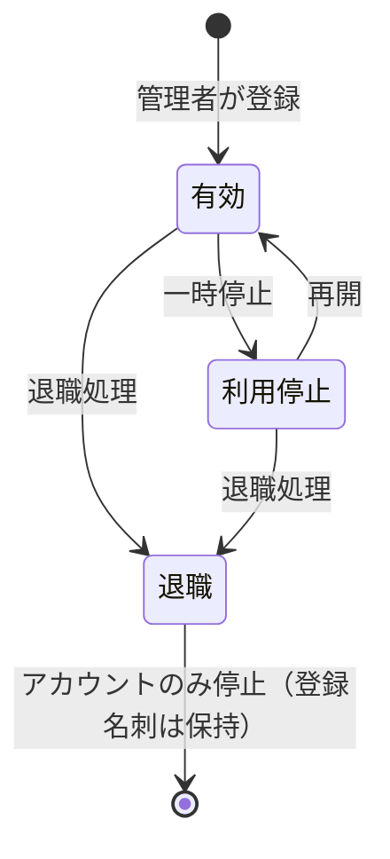
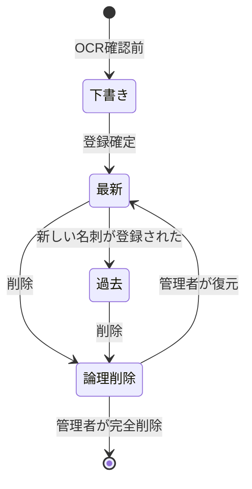

# 名刺一元管理システム 画面一覧・機能一覧

**Ver.0.3 ドラフト**

要件定義書 [`requirements-v0.2.md`](./requirements-v0.2.md) の確定事項を、画面と機能に展開したもの。
データ構造は [`data-model-v0.3.md`](./data-model-v0.3.md)、未確定事項は [`open-issues-v0.3.md`](./open-issues-v0.3.md) を参照。

**優先度の凡例**

| 記号 | 意味 |
| --- | --- |
| ◎ | 初期リリース必須 |
| ○ | 初期リリース推奨（実装期間により調整可） |
| △ | 次期以降 |

---

## 1. 画面一覧

### 1.1 認証・共通

| 画面ID | 画面名 | 概要 | 利用者 | 優先度 | 要件 |
| --- | --- | --- | --- | --- | --- |
| SC-01 | ログイン | ID／パスワード認証。IP制限による拒否メッセージ表示 | 全員 | ◎ | §6 |
| SC-02 | 多要素認証 | 管理者の社外アクセス時に必須 | 管理者 | ◎ | §6 |
| SC-03 | ホーム／ダッシュボード | 最近登録された名刺、自分の取込状況、管理者向け通知 | 全員 | ◎ | §2, §3 |
| SC-04 | マイページ | 自分の情報確認、パスワード変更、登録した名刺の一覧 | 全員 | ○ | §1 |
| SC-05 | エラー／権限なし | 403・404・セッションタイムアウト | 全員 | ◎ | §6 |

### 1.2 検索・閲覧

| 画面ID | 画面名 | 概要 | 利用者 | 優先度 | 要件 |
| --- | --- | --- | --- | --- | --- |
| SC-10 | 名刺検索・一覧 | フリーワード＋条件検索、一覧／カード表示切替、選択、CSV出力導線 | 全員 | ◎ | §7, §9 |
| SC-11 | 名刺詳細 | 名刺画像（表裏）とテキスト情報の並列表示、変更履歴導線 | 全員 | ◎ | §7 |
| SC-12 | 人物詳細（名刺履歴） | 1人物に紐づく名刺を時系列表示。最新／過去を区別 | 全員 | ◎ | §10 |
| SC-13 | 会社詳細 | 会社に紐づく人物・名刺の一覧 | 全員 | ○ | §10 |
| SC-14 | 名刺画像ビューア | 拡大・回転・原本／表示用切替 | 全員 | ◎ | §2, §7 |
| SC-15 | 変更履歴 | 対象レコードの変更者・日時・端末・変更前後・理由の一覧 | 全員 | ◎ | §7 |

### 1.3 登録・編集

| 画面ID | 画面名 | 概要 | 利用者 | 優先度 | 要件 |
| --- | --- | --- | --- | --- | --- |
| SC-20 | 名刺アップロード | 複数ファイルのドラッグ＆ドロップ、形式・サイズ検証 | 全員 | ◎ | §3, §4 |
| SC-21 | 取込ジョブ一覧 | キュー待ち／処理中／処理済み／失敗の件数と、明細の状況表示 | 全員 | ◎ | §3 |
| SC-28 | 取込ジョブ詳細 | ファイル単位の処理状況（試行回数・失敗理由）。処理中は自動更新 | 全員 | ◎ | §3 |
| SC-22 | 画像補正・分割確認 | 外周検出結果の調整、台形・回転補正、表裏設定、複数名刺の分割候補確認 | 全員 | ◎ | §4 |
| SC-23 | OCR結果確認・修正 | 名刺画像とOCR項目を左右に並べて確認・修正して登録 | 全員 | ◎ | §8 |
| SC-24 | 重複候補・登録方法の選択 | 既存人物との重複候補提示と6択（新規／追加／上書き／置換／履歴保持／中止） | 全員 | ◎ | §10 |
| SC-25 | 名刺編集 | 登録済み名刺の項目修正。変更理由の入力 | 全員（設定による） | ◎ | §7 |
| SC-26 | 名刺の手入力登録 | 画像なしでの登録（画像が用意できない場合） | 全員 | ○ | §4 |
| SC-27 | 人物・会社の統合 | 重複した人物／会社のマージ | 管理者 | ○ | §10 |

### 1.4 CSV出力

| 画面ID | 画面名 | 概要 | 利用者 | 優先度 | 要件 |
| --- | --- | --- | --- | --- | --- |
| SC-30 | CSV出力条件指定 | 出力対象（検索結果／選択／会社／期間／全件）と出力項目の指定 | 全員 | ◎ | §9 |
| SC-31 | 大量出力の確認 | 一定件数超過時の確認・注意表示 | 全員 | ◎ | §9 |
| SC-32 | 出力履歴（自分の分） | 自分が出力したCSVの履歴 | 全員 | ○ | §9 |

### 1.5 管理

| 画面ID | 画面名 | 概要 | 利用者 | 優先度 | 要件 |
| --- | --- | --- | --- | --- | --- |
| SC-40 | 利用者一覧・登録・編集 | 利用者の追加、状態（有効／利用停止／退職）、権限の変更 | 管理者 | ◎ | §1 |
| SC-41 | アクセス制御設定 | 許可IPアドレスの登録、管理者の社外アクセス許可方式の設定 | 管理者 | ◎ | §6 |
| SC-42 | 端末管理 | 端末識別ID・端末名称の登録、信頼端末の管理 | 管理者 | ○ | §9 |
| SC-43 | 削除済み名刺の管理 | 論理削除された名刺の確認・削除者・日時・理由の確認、復元、完全削除 | 管理者 | ◎ | §10 |
| SC-44 | 監査ログ照会 | 操作ログの検索・絞込・エクスポート | 管理者 | ◎ | §9, 確定21 |
| SC-45 | CSV出力ログ照会 | CSV出力ごとの利用者・日時・端末・IP・件数・条件・項目の確認 | 管理者 | ◎ | §9 |
| SC-46 | ログイン履歴照会 | ログイン成功／失敗履歴 | 管理者 | ◎ | §6 |
| SC-47 | システム設定 | 無操作ログアウト時間、容量アラート閾値、大量出力閾値、編集権限ポリシー等 | 管理者 | ◎ | §2, §6, §7, §9 |
| SC-48 | ストレージ・利用状況 | 保存容量、名刺件数、月次登録推移 | 管理者 | ○ | §2 |
| SC-49 | 部署・グループ管理 | 部署の登録と利用者の所属設定 | 管理者 | △ | §1（将来拡張） |

---

## 2. 機能一覧

### 2.1 認証・アクセス制御（FN-01〜）

| 機能ID | 機能名 | 内容 | 権限 | 優先度 | 要件 |
| --- | --- | --- | --- | --- | --- |
| FN-0101 | ログイン／ログアウト | ID・パスワード認証 | 全員 | ◎ | §6 |
| FN-0102 | 多要素認証 | 管理者の社外アクセス時に必須化 | 管理者 | ◎ | §6 |
| FN-0103 | IPアドレス制限 | 許可レンジ外からのアクセスを拒否 | 全員 | ◎ | §6 |
| FN-0104 | 管理者の社外アクセス制御 | 常時許可／必要時のみ許可を設定で切替 | 管理者 | ◎ | §6 |
| FN-0105 | 無操作自動ログアウト | 一定時間操作がない場合にセッション破棄 | 全員 | ◎ | §6 |
| FN-0106 | ログイン履歴・失敗履歴記録 | 日時・IP・端末・結果を記録 | 全員 | ◎ | §6 |
| FN-0107 | 端末識別ID発行 | 初回アクセス時に端末IDを発行しCookie等で保持 | 全員 | ◎ | §9 |
| FN-0108 | 通信の暗号化 | 全通信をHTTPSに限定 | 全員 | ◎ | §6 |

### 2.2 利用者管理（FN-02〜）

| 機能ID | 機能名 | 内容 | 権限 | 優先度 | 要件 |
| --- | --- | --- | --- | --- | --- |
| FN-0201 | 利用者登録・編集 | 利用者の追加と情報変更 | 管理者 | ◎ | §1 |
| FN-0202 | 利用者状態管理 | 有効／利用停止／退職の切替 | 管理者 | ◎ | §1 |
| FN-0203 | 権限管理 | 管理者／一般利用者の切替 | 管理者 | ◎ | §1 |
| FN-0204 | 退職者処理 | アカウント停止のみ行い、登録名刺・登録実績は保持 | 管理者 | ◎ | §10 |
| FN-0205 | 部署・グループ管理 | 部署の登録と所属設定（任意項目） | 管理者 | △ | §1 |

### 2.3 取込・OCR（FN-03〜）

| 機能ID | 機能名 | 内容 | 権限 | 優先度 | 要件 |
| --- | --- | --- | --- | --- | --- |
| FN-0301 | 単一ファイルアップロード | 1枚の名刺画像の取込 | 全員 | ◎ | §4 |
| FN-0302 | 複数ファイル一括アップロード | 複数ファイルの同時取込 | 全員 | ◎ | §3, §4 |
| FN-0303 | 対応形式の受付 | JPEG / JPG / PNG / PDF / HEIC / TIFF | 全員 | ◎ | §4 |
| FN-0304 | 形式変換 | HEIC・TIFF をサーバー側で JPEG/PNG に変換 | — | ◎ | §4 |
| FN-0305 | PDF分割 | PDF内の複数名刺をページ単位に分割 | — | ◎ | §4 |
| FN-0306 | 名刺外周の自動検出 | 画像内の名刺領域を検出 | — | ◎ | §4 |
| FN-0307 | 台形補正・回転補正 | 斜め撮影の補正 | — | ◎ | §4 |
| FN-0308 | 明るさ・コントラスト補正 | 画質の自動調整 | — | ◎ | §4 |
| FN-0309 | 表裏判定 | 表面／裏面の自動判定と手動修正 | 全員 | ○ | §4 |
| FN-0310 | 複数名刺の分割候補表示 | 1画像内の複数名刺を分割候補として提示 | 全員 | ○ | §4 |
| FN-0311 | 品質警告 | 解像度不足・ピンぼけの警告表示 | 全員 | ◎ | §4 |
| FN-0312 | 影の軽減・背景除去 | 撮影環境に起因するノイズ除去 | — | △ | §4 |
| FN-0313 | OCR実行 | 外部クラウドOCRへの送信と結果取得 | — | ◎ | §8 |
| FN-0314 | 項目分離 | 氏名・会社名・部署・役職・連絡先・住所への分解 | — | ◎ | §8 |
| FN-0315 | OCR結果の確認・修正 | 画像と項目を並べて確認・修正のうえ登録（自動確定しない） | 全員 | ◎ | §8 |
| FN-0316 | 取込状況表示 | 取込待ち／OCR処理中／確認待ち／登録完了／エラー。処理中は画面を自動更新 | 全員 | ◎ | §3 |
| FN-0320 | 取込キュー | アップロードはキュー登録のみで即応答し、ワーカーが順次処理する | — | ◎ | §3 |
| FN-0321 | ワーカーの滞留回収 | 停止したワーカーが抱えたファイルをキューへ戻す（既定3回で打ち切り） | — | ◎ | §3 |
| FN-0322 | LLMによる項目分離 | OCRテキストと名刺画像をLLMに渡し構造化出力で項目を得る（設定で切替） | — | ○ | §8, 論点C |
| FN-0317 | エラー再処理 | 失敗した明細のリトライ | 全員 | ◎ | §8 |
| FN-0318 | 原本／表示用画像の生成・保存 | 原本と圧縮画像を分けて保存 | — | ◎ | §2 |
| FN-0319 | 重複画像の検出 | チェックサムによる同一ファイルの二重取込検出 | — | ○ | §10 |

### 2.4 名刺・人物・会社の管理（FN-04〜）

| 機能ID | 機能名 | 内容 | 権限 | 優先度 | 要件 |
| --- | --- | --- | --- | --- | --- |
| FN-0401 | 名刺登録 | 確認済みOCR結果または手入力からの登録 | 全員 | ◎ | §8, §10 |
| FN-0402 | 重複人物の候補提示 | 既存人物との一致候補と一致理由の表示 | 全員 | ◎ | §10 |
| FN-0403 | 登録方法の選択 | 新規人物／追加名刺／上書き／置換／履歴保持／中止の6択 | 全員 | ◎ | §10 |
| FN-0404 | 標準動作（履歴保持） | 旧名刺を残し新名刺を最新として追加 | 全員 | ◎ | §10 |
| FN-0405 | 名刺編集 | 登録済み情報の修正（変更理由の入力） | 設定による | ◎ | §7 |
| FN-0406 | 名刺の論理削除 | 通常画面から非表示化 | 全員／管理者 | ◎ | §10 |
| FN-0407 | 削除済み名刺の確認 | 削除者・日時・理由の確認 | 管理者 | ◎ | §10 |
| FN-0408 | 名刺の復元 | 論理削除の取り消し | 管理者 | ◎ | §10 |
| FN-0409 | 完全削除 | 物理削除（監査ログ・変更履歴は残す） | 管理者 | ◎ | §10 |
| FN-0410 | 人物単位の名刺履歴表示 | 時系列での名刺一覧、最新／過去の区別 | 全員 | ◎ | §10 |
| FN-0411 | 複数会社・複数役職の管理 | 同一人物の複数所属を名刺単位で保持 | 全員 | ◎ | §10 |
| FN-0412 | 人物・会社の統合 | 重複レコードのマージ | 管理者 | ○ | §10 |
| FN-0413 | 統合の取り消し | 誤統合の分離 | 管理者 | ○ | 論点D |

### 2.5 検索・閲覧（FN-05〜）

| 機能ID | 機能名 | 内容 | 権限 | 優先度 | 要件 |
| --- | --- | --- | --- | --- | --- |
| FN-0501 | フリーワード検索 | 氏名・会社名・部署・役職・住所・備考の横断検索 | 全員 | ◎ | §7 |
| FN-0502 | 条件検索 | 会社・登録者・登録期間・名刺交換日・最新のみ等での絞込 | 全員 | ◎ | §7, §9 |
| FN-0503 | 名刺画像の閲覧 | 全利用者が画像を閲覧可能 | 全員 | ◎ | §7 |
| FN-0504 | 全件共有 | 登録者以外・退職者登録分も含め全利用者が閲覧可能 | 全員 | ◎ | §7 |
| FN-0505 | 変更履歴の閲覧 | 変更者・日時・端末・変更前後・理由の確認 | 全員 | ◎ | §7 |
| FN-0506 | 並び替え・表示切替 | 登録日・交換日・氏名順、一覧／カード表示 | 全員 | ○ | — |

### 2.6 CSV出力（FN-06〜）

| 機能ID | 機能名 | 内容 | 権限 | 優先度 | 要件 |
| --- | --- | --- | --- | --- | --- |
| FN-0601 | 検索結果のCSV出力 | 検索条件に一致する名刺の出力 | 全員 | ◎ | §9 |
| FN-0602 | 選択名刺のCSV出力 | 一覧で選択した名刺のみ出力 | 全員 | ◎ | §9 |
| FN-0603 | 会社指定・期間指定の出力 | 会社・期間を指定した出力 | 全員 | ◎ | §9 |
| FN-0604 | 全件出力 | 全名刺の出力 | 全員 | ◎ | §9 |
| FN-0605 | 出力項目の選択 | 指定した項目のみ出力 | 全員 | ◎ | §9 |
| FN-0606 | 大量出力の確認 | 閾値超過時に確認画面を表示 | 全員 | ◎ | §9 |
| FN-0607 | CSVへの管理情報付与 | 出力者・出力日時・管理番号・注意表示 | — | ○ | §9 |
| FN-0608 | CSV出力の監査記録 | 利用者・日時・ID・氏名・端末・IP・ブラウザ・件数・対象・条件・項目・ファイル名・結果・エラーを記録 | — | ◎ | §9 |
| FN-0609 | 非同期出力と通知 | 大量件数時のバックグラウンド生成とダウンロード通知 | 全員 | ○ | 論点I |

### 2.7 ログ・監査（FN-07〜）

| 機能ID | 機能名 | 内容 | 権限 | 優先度 | 要件 |
| --- | --- | --- | --- | --- | --- |
| FN-0701 | 操作ログ記録 | 上書き・削除・CSV出力等の重要操作をすべて記録 | — | ◎ | 確定21 |
| FN-0702 | 変更履歴記録 | 人物・会社・名刺の変更前後を保持 | — | ◎ | §7 |
| FN-0703 | 監査ログ照会 | 期間・利用者・操作種別での絞込検索 | 管理者 | ◎ | §9 |
| FN-0704 | CSV出力ログ照会 | 出力履歴の確認 | 管理者 | ◎ | §9 |
| FN-0705 | ログの改ざん防止 | 追記専用とし更新・削除を禁止 | — | ◎ | 確定21 |

### 2.8 システム管理（FN-08〜）

| 機能ID | 機能名 | 内容 | 権限 | 優先度 | 要件 |
| --- | --- | --- | --- | --- | --- |
| FN-0801 | 許可IP管理 | 拠点・VPNのIPレンジ登録 | 管理者 | ◎ | §6 |
| FN-0802 | 端末管理 | 端末識別ID・端末名称の登録 | 管理者 | ○ | §9 |
| FN-0803 | システム設定変更 | 各種閾値・ポリシーの設定 | 管理者 | ◎ | §2, §6, §7, §9 |
| FN-0804 | 容量監視・通知 | 保存容量が閾値に達した際の管理者通知 | — | ◎ | §2 |
| FN-0805 | バックアップ | DB・画像の定期バックアップとリストア手順 | — | ◎ | §5 |
| FN-0806 | 利用状況レポート | 登録件数・月次推移・利用者別登録数 | 管理者 | ○ | — |

---

## 3. 権限マトリクス

| 機能 | 一般利用者 | 管理者 | 利用停止・退職者 |
| --- | --- | --- | --- |
| ログイン | ○ | ○ | ✕ |
| 社外からのアクセス | ✕ | ○（MFA必須・設定による） | ✕ |
| 名刺の検索・閲覧（全件） | ○ | ○ | ✕ |
| 名刺画像の閲覧 | ○ | ○ | ✕ |
| 名刺の取込・登録 | ○ | ○ | ✕ |
| 名刺の項目修正 | ○ ※ | ○ | ✕ |
| 名刺の上書き・置換 | ○ ※（理由入力必須） | ○ | ✕ |
| 名刺の論理削除 | ○ ※（理由入力必須） | ○ | ✕ |
| 人物・会社の統合 | ✕ | ○ | ✕ |
| 削除済み名刺の確認・復元 | ✕ | ○ | ✕ |
| 完全削除 | ✕ | ○ | ✕ |
| CSV出力 | ○ | ○ | ✕ |
| 変更履歴の閲覧 | ○ | ○ | ✕ |
| 監査ログ・CSV出力ログの閲覧 | ✕ | ○ | ✕ |
| 利用者管理・システム設定 | ✕ | ○ | ✕ |

※ 編集権限ポリシー（[論点A](./open-issues-v0.3.md#論点a-名刺の編集権限)）の決定により変わる。表は推奨案（全利用者が編集可能＋履歴保持）を前提とする。
※ 退職者が過去に登録した名刺は引き続き全利用者が閲覧・利用できる（§10）。

---

## 4. 主要な状態遷移

### 4.1 取込ファイル（キュー）

`取込待ち(queued) → 処理中(processing) → 処理済み(done)`／失敗時は `エラー(error)`。
ワーカーが停止した場合は `処理中` のまま滞留した行をキューへ戻す（最大3回）。

### 4.2 取込明細

`取込待ち → OCR処理中 → 確認待ち → 登録完了`／各段階から `エラー`（再処理可能）。詳細は [`data-model-v0.3.md`](./data-model-v0.3.md#import_item取込明細名刺1枚に対応) を参照。

### 4.3 利用者

### 4.4 名刺

---

## 5. 非機能要件（Ver.0.3で確定が必要）

| 分類 | 項目 | 初期案 | 状態 |
| --- | --- | --- | --- |
| 性能 | 検索応答時間 | 1万件規模で2秒以内 | 要確定 |
| 性能 | アップロード応答 | ファイル数によらず1秒以内（キュー登録のみ） | 実測 0.05秒（3ファイル、PostgreSQL） |
| 性能 | OCR処理時間 | 1枚あたり10秒以内（確認待ちまで） | 実測 2.9秒（tesseract、[PoC](./ocr-poc-report.md)） |
| 性能 | 取込キューの消化 | — | 実測 3ファイルで6.1秒（4CPU・ワーカー2、PostgreSQL） |
| 精度 | OCR項目正答率 | — | 実測 44.8%（合成サンプル。[PoC](./ocr-poc-report.md)） |
| 性能 | 同時利用者数 | 10名（うち同時取込2名） | 要確定 |
| 可用性 | 稼働時間 | 平日8:00-20:00を主対象。SLA目標は未設定 | 要確定 |
| 可用性 | RPO / RTO | RPO 24時間、RTO 4営業時間 | [論点O](./open-issues-v0.3.md#その他の論点)。日次バックアップと復元手順は[運用手引き](./operations-guide.md#6-バックアップ)で整備済み |
| セキュリティ | 通信 | 全通信HTTPS | 確定。設定手順は[運用手引き §2.5](./operations-guide.md#25-httpsとリバースプロキシ) |
| セキュリティ | 保存データの暗号化 | ストレージ・DBの保存時暗号化を有効化 | ストレージ側は実装済み（`BCARDS_S3_SSE`、既定 AES256）。DB側は事業者選定後に確定 |
| セキュリティ | パスワードポリシー | 認証基盤に準拠 | [論点F](./open-issues-v0.3.md#論点f多要素認証の方式) |
| 対応環境 | ブラウザ | 主要ブラウザの最新版 | 要確定 |
| 対応環境 | スマートフォン | 撮影・アップロードを想定した画面対応 | 要確定 |
| 保守 | ログ保存期間 | 監査ログ3年以上 | [論点H](./open-issues-v0.3.md#その他の論点) |

---

## 6. 初期リリース範囲（案）

| 含める | 含めない（次期以降） |
| --- | --- |
| 認証・IP制限・MFA・自動ログアウト | 部署・グループ機能（SC-49 / FN-0205） |
| 取込（一括・PDF分割・形式変換・主要な画像補正） | 影の軽減・背景除去（FN-0312） |
| OCR＋確認・修正登録 | スキャナーの直接制御（§4で明示的に対象外） |
| 重複候補提示と6択の登録方法 | 外部システム連携（SFA/CRM等） |
| 検索・閲覧・変更履歴 | 名刺のQRコード・SNS情報の自動取得 |
| CSV出力＋監査ログ | 名刺情報の外部公開・共有リンク |
| 管理機能（利用者・削除済み・ログ・設定） | モバイルアプリ（ブラウザ対応で代替） |

---

## 7. Ver.0.3 確定に向けた残作業

1. [論点整理](./open-issues-v0.3.md)の A〜P を決裁し、本書の「設定による」「要確定」を確定値に置き換える
2. 個人情報の取扱いに関する章を要件定義書に追加する（[論点M](./open-issues-v0.3.md#その他の論点)）
3. 画面ごとの項目定義（画面項目一覧）とワイヤーフレームを作成する
4. CSV出力項目の確定版レイアウトを定義する
5. 非機能要件の数値を確定し、クラウド構成の見積に反映する
